# Simple Docker

## Part 1. Готовый докер

- Взять официальный докер образ с nginx и выкачать его при помощи ``docker pull``

 

- Проверить наличие докер образа через ``docker images``

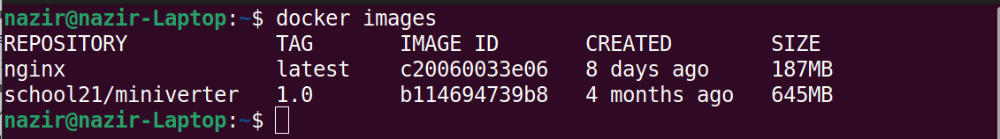 

- Запустить докер образ через ``docker run -d [image_id|repository]``

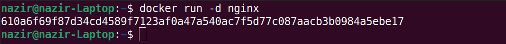 

- Проверить, что образ запустился через ``docker ps``

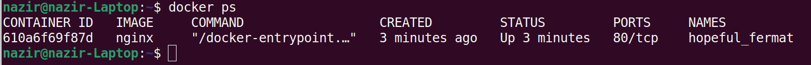 

- Посмотреть информацию о контейнере через ``docker inspect [container_id|container_name]``

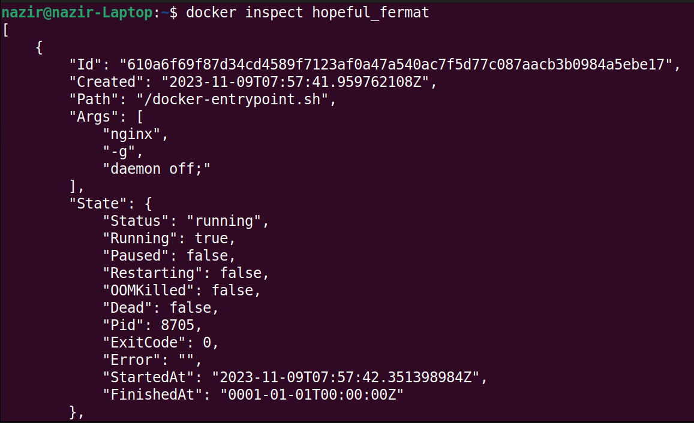 

- По выводу команды определить и поместить в отчёт размер контейнера, список замапленных портов и ip контейнера

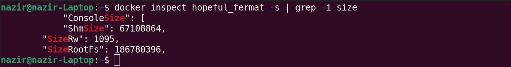 

 

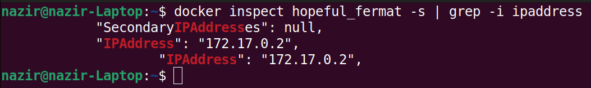 

- Остановить докер образ через ``docker stop [container_id|container_name]``

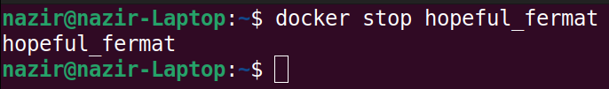 

- Проверить, что образ остановился через ``docker ps``

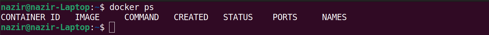 

- Запустить докер с портами 80 и 443 в контейнере, замапленными на такие же порты на локальной машине, через команду run

 

- Проверить, что в браузере по адресу localhost:80 доступна стартовая страница nginx

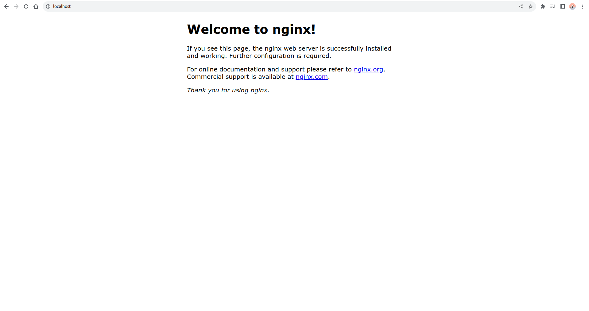 

- Перезапустить докер контейнер через docker restart [container_id|container_name]

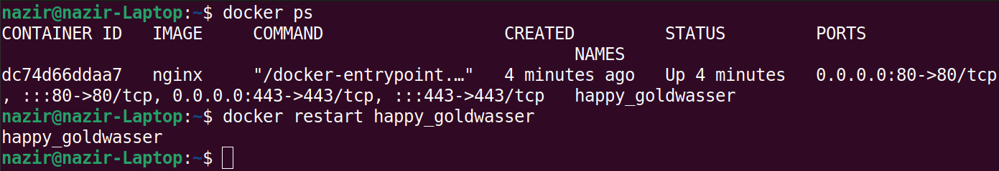 

- Проверить любым способом, что контейнер запустился

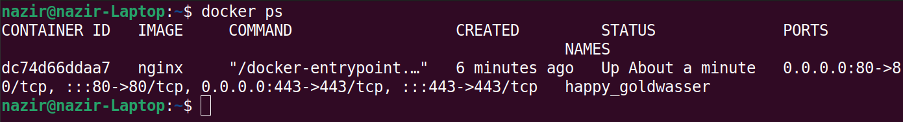 
